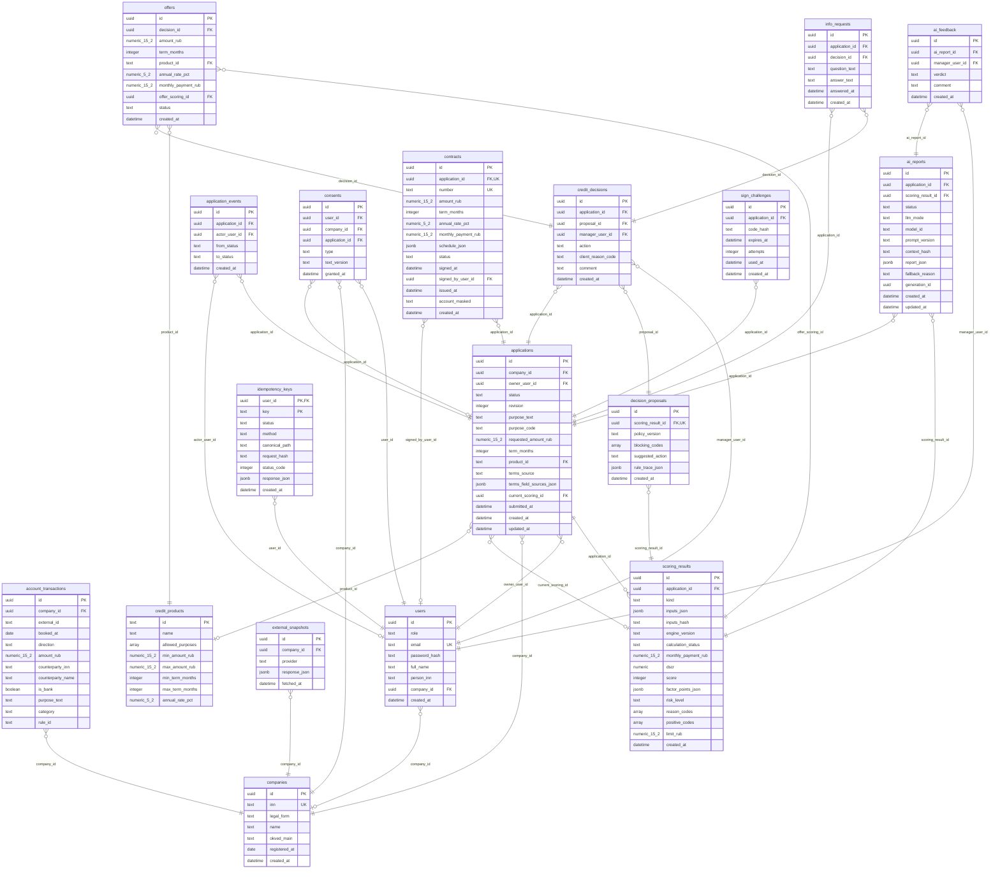

# ER-диаграмма

<!-- Генерируется `make er` (scripts/gen_er.py). Не редактировать вручную. -->

Описание таблиц и инвариантов — design.md §3.7, «Модель данных».

```mermaid
erDiagram
    account_transactions {
        uuid id PK
        uuid company_id FK
        text external_id
        date booked_at
        text direction
        numeric_15_2 amount_rub
        text counterparty_inn
        text counterparty_name
        boolean is_bank
        text purpose_text
        text category
        text rule_id
    }
    ai_feedback {
        uuid id PK
        uuid ai_report_id FK
        uuid manager_user_id FK
        text verdict
        text comment
        datetime created_at
    }
    ai_reports {
        uuid id PK
        uuid application_id FK
        uuid scoring_result_id FK
        text status
        text llm_mode
        text model_id
        text prompt_version
        text context_hash
        jsonb report_json
        text fallback_reason
        uuid generation_id
        datetime created_at
        datetime updated_at
    }
    application_events {
        uuid id PK
        uuid application_id FK
        uuid actor_user_id FK
        text from_status
        text to_status
        datetime created_at
    }
    applications {
        uuid id PK
        uuid company_id FK
        uuid owner_user_id FK
        text status
        integer revision
        text purpose_text
        text purpose_code
        numeric_15_2 requested_amount_rub
        integer term_months
        text product_id FK
        text terms_source
        jsonb terms_field_sources_json
        uuid current_scoring_id FK
        datetime submitted_at
        datetime created_at
        datetime updated_at
    }
    companies {
        uuid id PK
        text inn UK
        text legal_form
        text name
        text okved_main
        date registered_at
        datetime created_at
    }
    consents {
        uuid id PK
        uuid user_id FK
        uuid company_id FK
        uuid application_id FK
        text type
        text text_version
        datetime granted_at
    }
    contracts {
        uuid id PK
        uuid application_id FK,UK
        text number UK
        numeric_15_2 amount_rub
        integer term_months
        numeric_5_2 annual_rate_pct
        numeric_15_2 monthly_payment_rub
        jsonb schedule_json
        text status
        datetime signed_at
        uuid signed_by_user_id FK
        datetime issued_at
        text account_masked
        datetime created_at
    }
    credit_decisions {
        uuid id PK
        uuid application_id FK
        uuid proposal_id FK
        uuid manager_user_id FK
        text action
        text client_reason_code
        text comment
        datetime created_at
    }
    credit_products {
        text id PK
        text name
        array allowed_purposes
        numeric_15_2 min_amount_rub
        numeric_15_2 max_amount_rub
        integer min_term_months
        integer max_term_months
        numeric_5_2 annual_rate_pct
    }
    decision_proposals {
        uuid id PK
        uuid scoring_result_id FK,UK
        text policy_version
        array blocking_codes
        text suggested_action
        jsonb rule_trace_json
        datetime created_at
    }
    external_snapshots {
        uuid id PK
        uuid company_id FK
        text provider
        jsonb response_json
        datetime fetched_at
    }
    idempotency_keys {
        uuid user_id PK,FK
        text key PK
        text status
        text method
        text canonical_path
        text request_hash
        integer status_code
        jsonb response_json
        datetime created_at
    }
    info_requests {
        uuid id PK
        uuid application_id FK
        uuid decision_id FK
        text question_text
        text answer_text
        datetime answered_at
        datetime created_at
    }
    offers {
        uuid id PK
        uuid decision_id FK
        numeric_15_2 amount_rub
        integer term_months
        text product_id FK
        numeric_5_2 annual_rate_pct
        numeric_15_2 monthly_payment_rub
        uuid offer_scoring_id FK
        text status
        datetime created_at
    }
    scoring_results {
        uuid id PK
        uuid application_id FK
        text kind
        jsonb inputs_json
        text inputs_hash
        text engine_version
        text calculation_status
        numeric_15_2 monthly_payment_rub
        numeric dscr
        integer score
        jsonb factor_points_json
        text risk_level
        array reason_codes
        array positive_codes
        numeric_15_2 limit_rub
        datetime created_at
    }
    sign_challenges {
        uuid id PK
        uuid application_id FK
        text code_hash
        datetime expires_at
        integer attempts
        datetime used_at
        datetime created_at
    }
    users {
        uuid id PK
        text role
        text email UK
        text password_hash
        text full_name
        text person_inn
        uuid company_id FK
        datetime created_at
    }
    account_transactions }o--|| companies : "company_id"
    ai_feedback }o--|| ai_reports : "ai_report_id"
    ai_feedback }o--|| users : "manager_user_id"
    ai_reports }o--|| applications : "application_id"
    ai_reports }o--|| scoring_results : "scoring_result_id"
    application_events }o--|o users : "actor_user_id"
    application_events }o--|| applications : "application_id"
    applications }o--|o credit_products : "product_id"
    applications }o--|o scoring_results : "current_scoring_id"
    applications }o--|| companies : "company_id"
    applications }o--|| users : "owner_user_id"
    consents }o--|o applications : "application_id"
    consents }o--|| companies : "company_id"
    consents }o--|| users : "user_id"
    contracts }o--|o users : "signed_by_user_id"
    contracts }o--|| applications : "application_id"
    credit_decisions }o--|| applications : "application_id"
    credit_decisions }o--|| decision_proposals : "proposal_id"
    credit_decisions }o--|| users : "manager_user_id"
    decision_proposals }o--|| scoring_results : "scoring_result_id"
    external_snapshots }o--|| companies : "company_id"
    idempotency_keys }o--|| users : "user_id"
    info_requests }o--|| applications : "application_id"
    info_requests }o--|| credit_decisions : "decision_id"
    offers }o--|| credit_decisions : "decision_id"
    offers }o--|| credit_products : "product_id"
    offers }o--|| scoring_results : "offer_scoring_id"
    scoring_results }o--|| applications : "application_id"
    sign_challenges }o--|| applications : "application_id"
    users }o--|o companies : "company_id"
```
